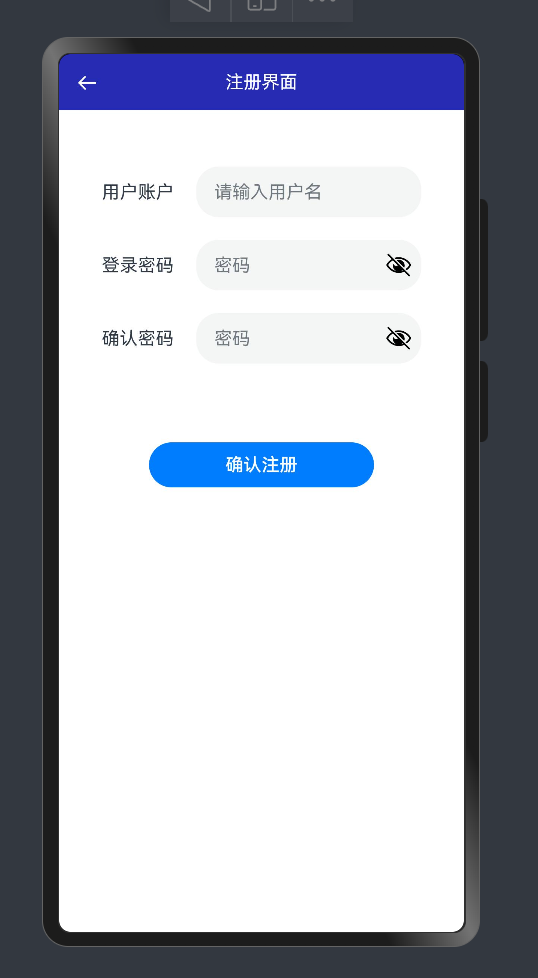

### 项目名称

Harmony云社交App

### 项目介绍

云社交是一款基于鸿蒙操作系统的社交媒体应用，专为提升用户间互动和内容分享而设计。它集成了用户认证、个性化资料、动态饲料、社交互动和消息通知等核心社交功能。用户可以发布和分享文本、享受点赞、评论和分享的社交体验。此外，应用提供搜索发现以及帖子分析等高级功能，确保用户体验的同时保护隐私和数据安全。云社交旨在为用户创造一个简洁、高效且安全的社交环境。

### 项目功能图


### 项目页面截图

#### 登录页面


登录页面根据用户输入的用户名密码来调用接口，并得到返回的结果来判断是否登录成功。

#### 注册页面



```arkTs
/**
 * 注册
 */
async postRegister(userRegisterModel: UserRegisterModel, resultCallBack?: ResultCallback) {
  await this.httpRequest().promise(postRegister(userRegisterModel).then(result => {
    let code = result.code;
    if (code == CommonConstant.SUCCESS_CODE) {
      console.log("注册成功");
      showToast("注册成功");
      router.back();
    } else if (code == CommonConstant.BUSSINESS_EORROR_CODE) {
      // 返回错误信息
      showToast(`${result.message}`);
    }
    resultCallBack?.(result);
  }),true)
}
```

```arkTs
Button("确认注册")
  .width("200vp")
  .offset({ x: "0vp", y: "70vp" })
  .onClick(() => {
    if (this.userRegisterModel.userAccount == "") {
      showToast("请输入用户名！");
      return;
    }
    if (this.userRegisterModel.userPassword == "" || this.userRegisterModel.checkPassword == "") {
      showToast("请输入密码！");
      return;
    }
    if (this.userRegisterModel.userPassword === this.userRegisterModel.checkPassword) {
      loginViewModel.postRegister(this.userRegisterModel)
    } else {
      showToast("两次密码输入不一致!");
    }
  })
```

前端首先会校验输入的用户名或者密码，如果通过校验，会发送请求给后端进行注册。在这过程中，后端有报错会将信息显示在前端。

#### 新闻页面


新闻与帖子页面都使用了List组件，并用ForEach组件进行循环渲染。

同时在List外层用Refresh组件包围，当用户下拉页面或者划到页底，会重新调用接口来请求新数据。

用户也可以点击进入某个新闻的详情页，在这里则是该新闻的外链。

#### 帖子页面


帖子页面则是每个用户发布的帖子，都可以在这里看到。

#### 帖子详情


详情页可以看到发布帖子的用户，点赞数和收藏数，并对该帖子进行点赞或者收藏。

#### 发布页面


#### 搜索页面


```java
/**
 * 搜索
 * @param titleOrContent
 * @return
 */
@Override
public List<Post> search(String titleOrContent) {
    QueryWrapper<Post> queryWrapper = new QueryWrapper<>();
    // 根据内容进行拼接
    queryWrapper.like("title", titleOrContent).or().like("content", titleOrContent);
    return baseMapper.selectList(queryWrapper);
}
```

该页面可以根据用户输入的内容进行数据库的模糊查询，如未有该内容，则会提示无相关结果。

#### 通知页面


#### 我的页面


